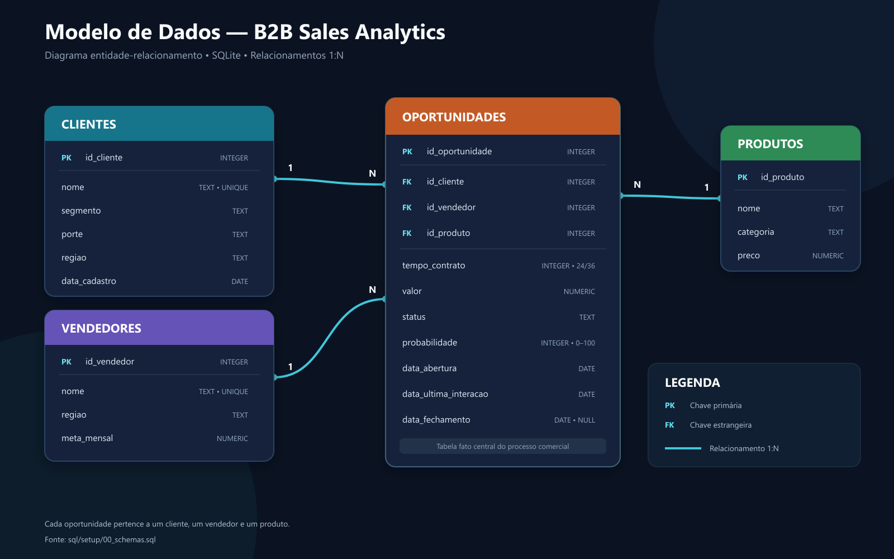

# Análise de Vendas B2B com SQL

[](docs/modelo_dados.png)

Este projeto analisa 1.000 oportunidades comerciais sintéticas de uma operação de vendas B2B, com o objetivo de avaliar o desempenho comercial, identificar concentrações e pontos de atenção no funil e mapear riscos no pipeline. Por meio de consultas SQL executadas em SQLite, foram investigados vendedores, clientes, produtos, contratos e indicadores da operação. O repositório inclui um banco SQLite pronto para exploração, o modelo relacional, consultas analíticas e um processo reproduzível de geração dos dados.

## Sumário

- [Problema de negócio](#problema-de-negócio)
- [Objetivos da análise](#objetivos-da-análise)
- [Tecnologias utilizadas](#tecnologias-utilizadas)
- [Estrutura do projeto](#estrutura-do-projeto)
- [Modelo de dados](#modelo-de-dados)
- [Como instalar e executar](#como-instalar-e-executar)
- [Como reconstruir o banco](#como-reconstruir-o-banco)
- [Principais perguntas respondidas](#principais-perguntas-respondidas)
- [Principais resultados](#principais-resultados)
- [Limitações e dados sintéticos](#limitações-e-dados-sintéticos)
- [Melhorias futuras](#melhorias-futuras)
- [Autor](#autor)

## Problema de negócio

Uma empresa que atua com vendas B2B precisa acompanhar o desempenho da operação comercial por meio de indicadores como receita, taxa de conversão, pipeline total e ponderado, ticket médio e ciclo de vendas. Também é necessário avaliar os resultados de vendedores, produtos, clientes e regiões para direcionar os esforços comerciais de maneira mais eficiente.

Embora os dados das oportunidades sejam registrados, eles precisam ser transformados em informações que ajudem a identificar os produtos com maior receita, as regiões com melhor desempenho, os clientes mais recorrentes e as oportunidades que exigem atenção. Essas informações podem apoiar a priorização do pipeline, o acompanhamento da equipe e o fortalecimento do relacionamento com os clientes.

Sem uma análise estruturada, torna-se difícil identificar concentrações no funil, oportunidades estagnadas, concentrações de receita e diferenças de desempenho entre vendedores, produtos e perfis de clientes. Nesse contexto, a análise oferece uma visão integrada da operação e apoia decisões relacionadas à priorização comercial, à gestão do pipeline e à alocação de esforços da equipe.

## Objetivos da análise

A análise tem como objetivo transformar os registros comerciais em indicadores que permitam avaliar o desempenho da operação e identificar pontos de atenção.

Os objetivos específicos são:

- Identificar concentrações e pontos de atenção nas etapas do funil de vendas.
- Mensurar a receita total, o ticket médio e o ciclo médio das vendas concluídas.
- Calcular o valor total e o valor ponderado do pipeline aberto.
- Comparar o desempenho dos vendedores em receita, conversão, ticket médio e cumprimento de metas.
- Comparar o desempenho comercial entre regiões, segmentos e portes de clientes.

## Tecnologias utilizadas

- **SQLite:** banco de dados relacional utilizado para armazenar e consultar os dados.
- **SQL:** linguagem utilizada na modelagem e nas análises comerciais.
- **Python:** utilizado para automatizar a construção e a população do banco.
- **Faker:** biblioteca utilizada na geração de dados fictícios.

### Ferramentas de desenvolvimento

- **DBeaver:** utilizado para explorar o banco e executar as consultas SQL.
- **Visual Studio Code:** utilizado para escrever e organizar os scripts do projeto.
- **Git:** utilizado no controle de versão.
- **GitHub:** utilizado para hospedar e apresentar o repositório.
- **OpenAI Codex:** utilizado como ferramenta de apoio na revisão de código, estruturação da documentação e discussão de decisões técnicas e conceituais.

### Recursos SQL aplicados

Entre os recursos utilizados nas análises estão:

- `INNER JOIN` para relacionar oportunidades, clientes, vendedores e produtos;
- funções agregadoras como `SUM`, `AVG` e `COUNT`;
- agrupamentos com `GROUP BY`;
- expressões condicionais com `CASE`;
- Common Table Expressions, ou CTEs, com `WITH`;
- funções de janela como `LAG`, `DENSE_RANK` e `SUM() OVER`;
- tratamento de divisões por zero com `NULLIF`;
- funções de data do SQLite, como `DATE`, `julianday` e `strftime`;
- chaves primárias e estrangeiras;
- restrições `NOT NULL`, `UNIQUE` e `CHECK`;
- índices em colunas utilizadas em relacionamentos e filtros analíticos.

## Estrutura do projeto

```text
b2b-sales-analytics-sql/
├── data/
│   └── b2b-sales.db
├── docs/
│   ├── modelo_dados.png
│   └── principais_insights.md
├── scripts/
│   ├── generators/
│   │   ├── clientes.py
│   │   └── oportunidades.py
│   ├── build_database.py
│   ├── config.py
│   └── database.py
├── sql/
│   ├── analysis/
│   │   ├── clientes.sql
│   │   ├── contratos.sql
│   │   ├── dashboard.sql
│   │   ├── desempenho_comercial.sql
│   │   ├── funil_vendas.sql
│   │   ├── produtos.sql
│   │   ├── riscos.sql
│   │   └── vendedores.sql
│   └── setup/
│       ├── 00_schemas.sql
│       └── 01_seed.sql
├── requirements.txt
└── README.md
```

## Modelo de dados

O banco segue um modelo relacional centrado na tabela oportunidades. Cada oportunidade está associada a um cliente, um vendedor e um produto.

|Tabela|Chave primária|Descrição|
|---|---|---|
|`clientes`|`id_cliente`|Empresas fictícias e suas características|
|`vendedores`|`id_vendedor`|Integrantes da equipe comercial e suas metas|
|`produtos`|`id_produto`|Produtos oferecidos e preços de referência|
|`oportunidades`|`id_oportunidade`|Negociações registradas no processo comercial|

### Clientes

A tabela clientes registra:

- nome;
- segmento;
- porte;
- região;
- data de cadastro.

### Vendedores

A tabela vendedores registra:

- nome;
- região de atuação;
- meta mensal.

### Produtos

A tabela produtos registra:

- nome;
- categoria;
- preço de referência.

### Oportunidades

A tabela oportunidades registra:

- cliente, vendedor e produto relacionados;
- duração do contrato;
- valor da oportunidade;
- status no funil;
- probabilidade de fechamento;
- data de abertura;
- data da última interação;
- data de fechamento.

As chaves estrangeiras preservam os relacionamentos entre as tabelas. Restrições `CHECK` controlam valores de domínio, como status, regiões, categorias, probabilidades e prazos contratuais.

## Como instalar e executar

### Pré-requisitos

Para explorar o banco existente, é necessário ter:

- SQLite 3.25 ou superior; ou
- uma interface compatível, como o DBeaver.

Python é necessário apenas para reconstruir o banco.

### Clonar o repositório

```bash
git clone https://github.com/vxnuzz/b2b-sales-analytics-sql.git
cd b2b-sales-analytics-sql
```

### Explorar o banco pelo DBeaver

1. Abra o DBeaver.
2. Crie uma conexão SQLite.
3. Selecione o arquivo `data/b2b-sales.db`.
4. Abra um editor SQL.
5. Carregue uma consulta do diretório `sql/analysis/`.
6. Execute a consulta e analise o resultado.

### Explorar pelo terminal

Abra o banco como:

```powershell
sqlite3 data/b2b-sales.db
```

No console do SQLite, habilite os cabeçalhos e execute uma análise:

```sql
.headers on
.mode column
.read sql/analysis/dashboard.sql
```

Para encerrar:

```sql
.quit
```

## Como reconstruir o banco

A reconstrução é opcional. O banco pronto já está disponível em `data/b2b-sales.db`.

O processo de reconstrução utiliza uma data de referência e sementes aleatórias fixas, garantindo que os mesmos dados e resultados sejam gerados novamente.

### Criar um ambiente virtual

No Windows com PowerShell:

```powershell
py -m venv .venv
.\.venv\Scripts\Activate.ps1
```

No Linux ou macOS:

```bash
python3 -m venv .venv
source .venv/bin/activate
```

### Instalar as dependências

```powershell
python -m pip install -r requirements.txt
```

No Windows, caso o comando python não esteja disponível, utilize py.

### Gerar o banco

Caso o arquivo ainda não exista:

```powershell
python scripts/build_database.py
```

Para substituir deliberadamente o banco existente:

```powershell
python scripts/build_database.py --force
```

A opção --force deve ser utilizada com atenção, pois substitui o arquivo existente em `data/b2b-sales.db`.

O processo executa as seguintes etapas:

1. Cria tabelas, restrições e índices definidos em `00_schemas.sql`.
2. Insere os vendedores e produtos definidos em `01_seed.sql`.
3. Gera 100 clientes fictícios.
4. Gera 1.000 oportunidades comerciais.
5. Publica o banco somente depois que a construção é concluída com sucesso.

Os principais parâmetros ficam centralizados em `scripts/config.py`, incluindo:

- data de referência;
- quantidade de clientes;
- quantidade de oportunidades;
- sementes utilizadas na geração.

Modificar esses parâmetros produz um cenário diferente e, consequentemente, resultados diferentes.

## Principais perguntas respondidas

As consultas foram organizadas por domínio de negócio.

### Desempenho comercial

- Quanto foi vendido por mês, trimestre e ano?
- A receita está aumentando ou diminuindo?
- Qual é o ticket médio das vendas?
- Quanto tempo uma oportunidade leva para ser fechada?
- O ciclo de vendas está aumentando?
- Quais oportunidades representam a maior parte da receita?

### Funil de vendas

- Quantas oportunidades existem em cada etapa?
- Qual é o valor financeiro acumulado em cada etapa?
- Onde está a maior concentração do funil?
- Quais negócios possuem alta probabilidade e nenhuma interação recente?
- Qual é o valor ponderado do pipeline?

### Vendedores

- Quem vende mais em receita e quantidade?
- Qual vendedor apresenta a melhor taxa de conversão?
- Quem possui o maior ticket médio?
- Quem apresenta o menor ciclo de vendas?
- Quais vendedores possuem oportunidades estagnadas?
- Quais vendedores estão atingindo suas metas?

### Clientes e mercado

- Quais segmentos geram mais receita?
- Qual segmento apresenta a maior conversão?
- Qual porte de cliente possui o maior ticket médio?
- Quais regiões geram mais oportunidades, vendas e receita?
- Quais clientes compraram mais de uma vez?
- Quais clientes possuem várias oportunidades abertas?

### Produtos

- Quais produtos e categorias geram mais receita?
- Quais categorias apresentam maior conversão?
- Quais produtos possuem ciclos de vendas mais longos?
- Quais produtos são mais procurados por segmento, porte e região?
- Quais produtos têm muito interesse, mas baixa conversão?

### Contratos

- Contratos de 24 ou 36 meses convertem melhor?
- Qual prazo contratual produz o maior ticket médio?
- Quais segmentos preferem cada duração?
- Contratos de 36 meses demoram mais para fechar?

### Perdas e riscos

- Quais vendedores, produtos e segmentos apresentam mais perdas?
- Quais oportunidades estão sem interação há mais de 30 dias?
- Quanto valor está em risco no pipeline?
- Existem concentrações excessivas em determinados clientes ou produtos?

## Principais resultados

Os resultados utilizam *3 de agosto de 2026* como data fixa de referência.

|Indicador|Resultado|
|---|---|
|Oportunidades analisadas|1.000|
|Receita das oportunidades ganhas|R$ 6.373.876,19|
|Taxa de conversão das oportunidades encerradas|69,85%|
|Ticket médio das vendas ganhas|R$ 28.078,75|
|Ciclo médio das vendas ganhas|45,3 dias|
|Oportunidades no pipeline aberto|675|
|Valor total do pipeline aberto|R$ 18.632.398,00|
|Pipeline ponderado pela probabilidade|R$ 7.265.268,25|
|Oportunidades sem interação há mais de 30 dias|159|
|Valor total em risco|R$ 4.718.017,57|

Outros resultados relevantes:

- A etapa de *Prospecção* apresenta a maior concentração do funil, com 222 oportunidades.
- As oportunidades estagnadas correspondem a 23,56% do pipeline aberto.
- O valor ponderado das oportunidades em risco é de R$ 1.855.581,12.
- *Luciano Zorte* apresenta a maior receita, com R$ 596.165,15.
- *Luciano Zorte* também apresenta a maior conversão, com 80,00%.
- Todos os 15 vendedores atingiram a meta mensal em pelo menos um mês.
- *Inteligência Artificial* é a categoria com maior receita, totalizando R$ 1.850.865,76.
- *Tecnologia* é o segmento com maior conversão, atingindo 74,71%.
- Clientes de *grande porte* apresentam o maior ticket médio, de R$ 28.854,95.

As interpretações detalhadas e as recomendações estão disponíveis em [Principais insights](docs/principais_insights.md).

## Limitações e dados sintéticos

Todos os clientes, vendedores e eventos comerciais presentes no projeto são fictícios. Os dados foram gerados exclusivamente para fins educacionais e de portfólio e não representam uma empresa real.

As distribuições e os relacionamentos observados refletem as regras definidas no processo de geração. Por isso, os resultados não devem ser generalizados para o mercado de vendas B2B nem utilizados para fundamentar decisões comerciais reais.

Outras limitações incluem:

- ausência de custos e margens, o que impede análises de rentabilidade;
- ausência de motivos de perda, atividades comerciais e satisfação dos clientes;
- ausência do histórico de movimentação das oportunidades entre as etapas;
- probabilidades de fechamento definidas de acordo com o status da oportunidade;
- previsão de receita baseada em uma estimativa didática, não em um modelo estatístico validado;
- ausência de informações sobre churn, renovação e retenção de clientes.

A análise permite identificar diferenças, padrões e pontos de atenção, mas não determinar sozinha as causas dos resultados encontrados.

## Melhorias futuras

Possíveis evoluções do projeto incluem:

- criar um dashboard interativo em Power BI, Tableau ou Streamlit;
- adicionar o histórico de movimentação das oportunidades no funil;
- calcular conversões entre etapas e o tempo de permanência em cada uma;
- incluir motivos de perda, origem dos leads e atividades comerciais;
- adicionar custos e margens para permitir análises de rentabilidade;
- criar views para centralizar a definição dos principais indicadores;
- implementar testes automatizados de qualidade dos dados;
- comparar as previsões de receita com os valores realizados;
- migrar o projeto para PostgreSQL;
- automatizar a execução das consultas e a atualização dos indicadores.

## Autor

Desenvolvido por *Vinicius Ramos*

- [Meu LinkedIn](https://www.linkedin.com/in/vrdataanalyst/)
- [Meu GitHub](https://github.com/vxnuzz)
